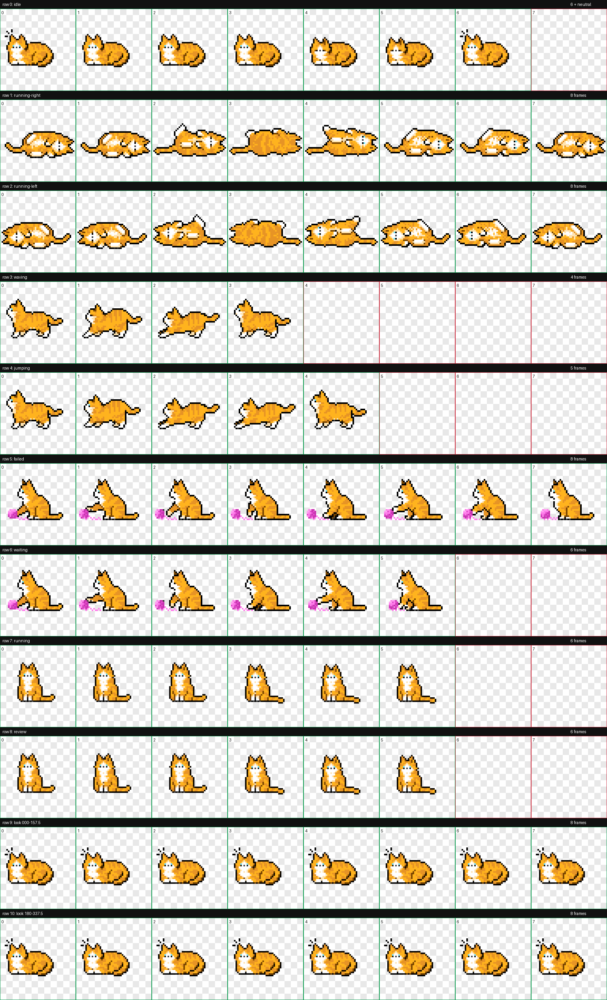

# MEOW Codex Pet

macOS용 [MEOW](https://github.com/CodlingDev/MEOW)의 기본 주황 고양이 에셋을 그대로 재사용해 Codex용 애니메이션 펫으로 패키징하는 프로젝트입니다.

새 그림을 생성하거나 원본을 다시 그리지 않습니다. 원본 1x PNG의 보이는 픽셀은 그대로 유지하고, 고정 크롭과 프레임 선택, `running-right` 수평 반전만 적용합니다.

## 목표

- MEOW의 기본 품종인 `cat_orange` 정체성을 보존합니다.
- Codex Pet v2의 9개 표준 상태를 MEOW의 `idle`, `roll`, `stretch`, `play`, `sleep`으로 표현합니다.
- 방향 반응은 사용하지 않으며 16개 방향 슬롯에는 동일한 `sleep` 프레임을 배치합니다.
- 조립, 검증, 설치 과정을 재현 가능하게 기록합니다.
- 최종 펫과 QA 산출물을 저장소에서 함께 관리합니다.

## Codex Pet v2 규격

| 항목 | 값 |
| --- | --- |
| 셀 크기 | `192 × 208` |
| 아틀라스 | 8열 × 11행 |
| 최종 크기 | `1536 × 2288` |
| 표준 상태 | `idle`, `running-right`, `running-left`, `waving`, `jumping`, `failed`, `waiting`, `running`, `review` |
| 시선 방향 | 반응 없음, 16개 슬롯에 동일한 `sleep_0` 사용 |
| 매니페스트 | `spriteVersionNumber: 2` |

행별 의미와 필수 검증 기준은 [Codex Pet v2 제작 기준](docs/CODEX_PET_V2.md)에 정리합니다.

## 원본 에셋

`CatFactory.makeCat`의 기본 품종인 `.orange`를 기준 캐릭터로 사용합니다. 실제 조립에 필요한 5개 상태의 추적된 1x PNG 전체를 `references/cat-orange/`에 보존합니다.

- 기준 원본: `CodlingDev/MEOW`
- 기준 커밋: `75a45c3ada731cac99e1df5a5bada598d8de64d2`
- 원본 해상도: `256 × 256`, 알파 채널 포함
- 포함 프레임: `idle` 2장, `roll` 18장, `stretch` 17장, `play` 12장, `sleep` 4장
- 라이선스와 체크섬: [에셋 출처](docs/ASSET_PROVENANCE.md)

## 상태 매핑

| Codex 상태 | MEOW 상태 | 처리 |
| --- | --- | --- |
| `idle` | `sleep` | 3개 자세를 장기 유지하도록 중복해 체감 속도를 낮춤 |
| `running-right` | `roll` | 시작·종료 자세를 중복하고 수평 반전해 포즈 변경 빈도를 낮춤 |
| `running-left` | `roll` | 시작·종료 자세를 중복해 포즈 변경 빈도를 낮춤 |
| `waving` | `stretch` | 시작부터 복귀까지 완결된 원본 동작의 대표 프레임 사용 |
| `jumping` | `stretch` | 시작부터 복귀까지 완결된 원본 동작의 대표 프레임 사용 |
| `failed` | `play` | 사용자 상호작용이 필요한 상태를 8개 프레임으로 표현 |
| `waiting` | `play` | 사용자 상호작용이 필요한 상태를 6개 프레임으로 표현 |
| `running` | `idle` | 앉은 자세 2개를 각각 3칸씩 유지 |
| `review` | `idle` | 앉은 자세 2개를 각각 3칸씩 유지 |
| 방향 16칸 | `sleep_0` | 모두 동일한 프레임, 방향 반응 없음 |

## 프로젝트 구조

```text
MEOW-CodexPet/
├── scripts/                 # 원본 에셋 기반 결정적 아틀라스 조립
├── docs/                    # 규격, 출처, 제작 및 검증 기록
├── references/cat-orange/   # 실제 사용하는 MEOW 원본 1x 프레임
├── pets/meow/               # 배포 가능한 pet.json과 spritesheet.webp
└── qa/meow/                 # 최종 검증 결과와 시각 QA 산출물
```

조립 중 추출한 셀은 `.hatch/`에서 작업하며 Git에 포함하지 않습니다.

## 개발 흐름

1. `references/cat-orange/`에서 원본 상태와 프레임 수를 검증합니다.
2. 모든 원본 캔버스에 동일한 `(48, 24, 240, 232)` 크롭을 적용합니다.
3. 상태별 대표 프레임을 선택하고 `running-right`만 셀 단위로 수평 반전합니다.
4. `1536 × 2288` lossless WebP 아틀라스를 조립하고 픽셀 왕복과 v2 구조를 검증합니다.
5. 통과한 결과만 `pets/meow/`와 `qa/meow/`에 반영합니다.

## 결과 미리보기



9개 표준 상태의 GIF와 방향 고정 결과는 [`qa/meow/`](qa/meow/)에서 확인할 수 있습니다. 최종 검증 결과는 [QA 보고서](docs/QA_REPORT.md)에 정리했습니다.

## 빌드

Pillow를 설치한 뒤 아틀라스를 재현할 수 있습니다.

```bash
python3 -m pip install -r requirements.txt
make build
```

## 설치

저장소의 `pet.json`과 `spritesheet.webp`를 같은 Codex 펫 폴더에 복사합니다.

```bash
PET_DIR="${CODEX_HOME:-$HOME/.codex}/pets/meow"
mkdir -p "$PET_DIR"
cp pets/meow/pet.json "$PET_DIR/pet.json"
cp pets/meow/spritesheet.webp "$PET_DIR/spritesheet.webp"
```

## 검증

```bash
make qa
```

검증은 lossless WebP 픽셀 왕복, `1536 × 2288` v2 구조, 투명 셀, 미리보기 GIF와 전체 contact sheet를 확인합니다.

Codex 앱은 상태별 프레임 시간과 비-idle 상태의 3회 반복을 고정합니다. 이 펫은 배포 호환성을 유지하기 위해 런타임을 수정하지 않고 원본 프레임 중복으로 누운 `sleep`, 앉은 `idle`, `roll`의 포즈 변경 빈도를 낮춥니다. `stretch`는 반복 횟수를 줄일 수 없으므로 동작이 중간에 끊기지 않도록 시작부터 복귀까지 완결된 원본 순서를 우선합니다.

## 현재 상태

- [x] 원본 저장소 및 Git 전략 초기화
- [x] 기본 품종과 기준 에셋 선정
- [x] 원본 5개 상태 전체 프레임 보존
- [x] 사용자 지정 9개 상태 매핑
- [x] 방향 반응 비활성화
- [x] v2 아틀라스 검증 및 패키징

## Git 전략

### 태그 컨벤션

- `init`: 가장 처음 Initial Commit에 태그를 붙일 때 사용합니다.
- `feat`: 새로운 기능을 구현할 때 사용합니다.
- `fix`: 버그나 오류를 해결할 때 사용합니다.
- `docs`: README, 템플릿 등 프로젝트 문서를 수정할 때 사용합니다.
- `setting`: 프로젝트 관련 설정을 변경할 때 사용합니다.
- `add`: 사진 등 에셋이나 라이브러리를 추가할 때 사용합니다.
- `refactor`: 기존 코드를 리팩터링하거나 수정할 때 사용합니다.
- `chore`: 중요도가 낮은 단순 수정에 사용합니다.

### 커밋 컨벤션

태그는 반드시 소문자로 작성합니다. 내용은 한글 명령조로 작성하고, 제목은 50자를 넘기지 않습니다. 설명이 필요한 경우 commit description에 작성합니다.

```text
[feat] 로그인 기능 구현
```

### 브랜치 컨벤션

```text
태그/#이슈번호-작업하는파일
```

예시:

```text
feat/#1-loginUI
```

### 브랜치 전략

- `main`: 출시(release)에 사용하는 브랜치입니다.
- `develop`: 개발된 기능을 최종적으로 합쳐 확인하는 기본 브랜치입니다.
  - 개인 브랜치의 작업이 끝나면 개인 브랜치에서 최신 `develop`을 먼저 병합합니다.
  - 충돌과 검증을 마친 뒤 `develop`을 대상으로 Pull Request를 요청합니다.
- `feature`: 태그를 붙이는 모든 작업 브랜치를 의미합니다. 기능 개발, 버그 수정, 문서와 설정 변경은 반드시 작업 브랜치에서 진행합니다.
